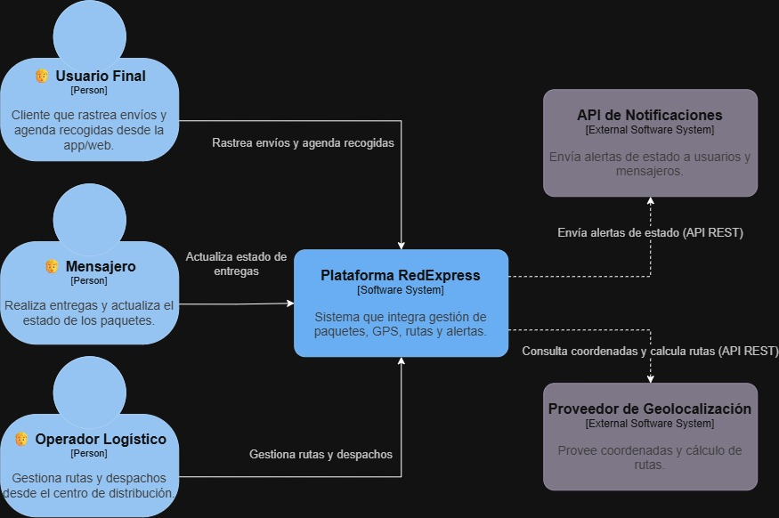

# 🗒️ Registro de Trabajo en Clase - Taller 3: Arquitectura Actual del Sistema con el Modelo C4

## 📆 Fecha de la sesión
6 de septiembre de 2026

## 👥 Integrantes presentes
- Brayan Presiga
- Julián Aguirre
- Jorge Alarcon

---

# Nivel C1 – Vista de Contexto

## 🧠 Actividades realizadas en clase
- **¿Qué se discutió con el equipo?** Se analizó el caso base de RedExpress, una empresa nacional de logística y envíos, con el fin de identificar los actores principales, los sistemas que componen su arquitectura y las relaciones entre ellos.
- **¿Qué decisiones de modelado se tomaron?** Se definió representar el nivel C1 (Vista de Contexto) mostrando tres actores (Usuario Final, Mensajero y Operador Logístico) interactuando con la Plataforma RedExpress como sistema central, y dos sistemas externos (API de Notificaciones y Proveedor de Geolocalización) integrados mediante APIs REST.
- **¿Qué herramientas se usaron?** Draw.io, para construir el diagrama de contexto de forma digital.
- **¿Qué parte del trabajo se alcanzó a desarrollar?** Se completó el diagrama C1 con sus actores, sistemas y relaciones, junto con la descripción de cada elemento.
  
## 🧩 Boceto inicial del modelo

> Diagrama de contexto (C1) elaborado en draw.io, mostrando los actores (Usuario Final, Mensajero, Operador Logístico), el sistema central (Plataforma RedExpress) y los sistemas externos (API de Notificaciones, Proveedor de Geolocalización).

## 📋 Tabla de actores, entidades o componentes

| Nombre del elemento | Tipo | Descripción | Responsable |
|---------------------|------|-------------|-------------|
| Usuario Final | Actor | Cliente que rastrea envíos y agenda recogidas desde la app/web | Cliente |
| Mensajero | Actor | Realiza entregas y actualiza el estado de los paquetes en tiempo real | Cliente |
| Operador Logístico | Actor | Gestiona rutas y despachos desde el centro de distribución | Cliente |
| Plataforma RedExpress | Sistema (Software System) | Sistema central que integra gestión de paquetes, seguimiento GPS, motor de rutas y alertas | RedExpress |
| API de Notificaciones | Sistema externo (Software System) | Envía alertas de estado por API REST a usuarios y mensajeros | Proveedor externo |
| Proveedor de Geolocalización | Sistema externo (Software System) | Provee coordenadas y cálculo de rutas por API REST | Proveedor externo |

## 🧮 Análisis del modelo C1

**Cómo se estructura el modelo entregado:**
El modelo C1 se estructura alrededor de un sistema central, la Plataforma RedExpress, que concentra la lógica del negocio. Alrededor de este sistema se ubican tres actores humanos (Usuario Final, Mensajero, Operador Logístico), cada uno con una relación funcional distinta hacia la plataforma, y dos sistemas externos que se comunican con ella mediante interfaces API REST. Esta estructura sigue el estándar del modelo C4 para el nivel de contexto: mostrar el sistema de interés en el centro, sin detallar su arquitectura interna, y representar únicamente sus fronteras de interacción con actores y sistemas externos.

**Cómo representa las necesidades del cliente:**
El diagrama refleja las necesidades operativas descritas en el caso de RedExpress: el rastreo en tiempo real de paquetes (relación del Usuario Final), la actualización del estado de entregas en campo (relación del Mensajero), la coordinación de rutas y despachos (relación del Operador Logístico), y la dependencia de servicios externos para notificar a los usuarios y calcular rutas óptimas. De esta forma, el modelo captura tanto la interacción de los usuarios finales como la infraestructura de soporte que la empresa necesita para escalar su operación.

**Qué supuestos se tomaron:**
- Se asumió que la comunicación entre la Plataforma RedExpress y los sistemas externos (Notificaciones y Geolocalización) se realiza exclusivamente mediante API REST, sin considerar otros protocolos.
- Se asumió que el Operador Logístico y el Mensajero interactúan directamente con la misma plataforma central, y no con sistemas separados (como una web para operadores mencionada en el contexto original), dado que el diagrama entregado no los distingue como contenedores separados.
- Se asumió que las bases de datos, balanceadores de carga y demás elementos de infraestructura no se representan en este nivel, ya que corresponden al nivel C2 (Vista de Contenedores).
- Se asumió que "Usuario Final" agrupa tanto a clientes individuales como a clientes corporativos que usan el dashboard de seguimiento, sin diferenciarlos como actores separados en este nivel.

---

# Nivel C2 – Vista de Contenedores

## 🧠 Actividades realizadas en clase
- **¿Qué se discutió con el equipo?** Se discutió cómo descomponer la Plataforma RedExpress —representada como una única caja en el C1— en las aplicaciones y servicios reales que la componen, sin perder de vista la responsabilidad concreta de cada uno. También se retomaron los actores y sistemas externos ya identificados en el C1 para definir con qué contenedor específico interactúa cada uno.
- **¿Qué decisiones de modelado se tomaron?** Se decidió separar el **Motor de Rutas** y el **Seguimiento GPS** como contenedores independientes del **Módulo de Gestión de Paquetes**, en lugar de dejar un único contenedor que hiciera de todo — siguiendo el error común señalado en la guía ("un solo contenedor gigante que hace de todo"). Se decidió también que el **Operador Logístico** entra por un contenedor distinto (Portal Web Operadores) al de Usuario Final y Mensajero (App Móvil), aunque en el C1 ambos canales quedaran ocultos dentro de la misma caja — esto corrige el supuesto simplificado que se había tomado en el C1. Cada contenedor se etiquetó con su tecnología para dejar explícita la decisión de implementación.
- **¿Qué herramientas se usaron?** Draw.io.
- **¿Qué parte del trabajo se alcanzó a desarrollar?** Se completó el diagrama C2 con los 6 contenedores, las 2 piezas de infraestructura de soporte, y las 13 relaciones etiquetadas con su protocolo correspondiente (HTTPS/JSON, SQL, REST, Push/WebSocket).
## 🧩 Boceto inicial del modelo

> Diagrama de contenedores (C2) elaborado en draw.io, mostrando los 6 contenedores de la Plataforma RedExpress (App Móvil, Portal Web Operadores, Módulo de Gestión de Paquetes, Motor de Rutas, Seguimiento GPS, Sistema de Alertas), la infraestructura de soporte (Balanceador de Carga, Base de Datos Distribuida), y su conexión con los actores y sistemas externos ya definidos en el C1.
## 📋 Tabla de actores, entidades o componentes (si aplica)
 
| Nombre del elemento | Tipo | Descripción | Responsable |
|---------------------|------|-------------|-------------|
| App Móvil | Contenedor (React Native) | Usada por Usuario Final y Mensajero para rastrear envíos y actualizar el estado de entregas | RedExpress |
| Portal Web Operadores | Contenedor (React) | Usado por el Operador Logístico para gestionar rutas y despachos | RedExpress |
| Balanceador de Carga | Infraestructura | Recibe el tráfico HTTPS de App Móvil y Portal Web, y lo enruta hacia el Módulo de Gestión de Paquetes | RedExpress |
| Módulo de Gestión de Paquetes | Contenedor (Node.js) | Orquesta el ciclo de vida del paquete: coordina con el Motor de Rutas, el Seguimiento GPS y el Sistema de Alertas, y persiste en la base de datos | RedExpress |
| Motor de Rutas | Contenedor (Servicio Python) | Calcula la ruta óptima consultando coordenadas al Proveedor de Geolocalización externo | RedExpress |
| Seguimiento GPS | Contenedor (Servicio Go) | Recibe la ubicación en tiempo real del mensajero y la transmite de vuelta a la App Móvil vía WebSocket | RedExpress |
| Sistema de Alertas | Contenedor (Servicio Node.js) | Dispara la notificación hacia la API de Notificaciones externa cuando cambia el estado de un paquete | RedExpress |
| Base de Datos Distribuida | Infraestructura | Persiste la información de paquetes, rutas y usuarios | RedExpress |
 
## 🧮 Análisis del modelo C2
 
**Cómo se estructura el modelo entregado:**
El modelo C2 abre la caja única "Plataforma RedExpress" del C1 en 6 contenedores y 2 piezas de infraestructura de soporte, manteniendo visibles los mismos actores y sistemas externos del C1 pero conectados ahora a un contenedor específico y no a la plataforma en general — tal como exige la metodología. El flujo general es: los dos canales de entrada (App Móvil y Portal Web) pasan por un balanceador de carga común antes de llegar al Módulo de Gestión de Paquetes, que actúa como orquestador central y delega en los tres servicios especializados (rutas, GPS, alertas).
 
**Cómo representa las necesidades del cliente:**
La separación de responsabilidades (Motor de Rutas, Seguimiento GPS y Sistema de Alertas como contenedores independientes del módulo central) refleja directamente la necesidad del caso base de "escalar a nuevas regiones" y "garantizar alta disponibilidad y rendimiento... durante campañas promocionales o temporadas de alto volumen": al ser servicios separados, cada uno puede escalarse de forma independiente según cuál sea el cuello de botella real (por ejemplo, el Seguimiento GPS bajo alta concurrencia de mensajeros, sin necesidad de escalar también el Sistema de Alertas). El Balanceador de Carga y la Base de Datos Distribuida, por su parte, sostienen directamente el requisito de alta disponibilidad mencionado en el caso base.
 
**Qué supuestos se tomaron:**
- Se asumió una tecnología específica por contenedor (React Native, React, Node.js, Python, Go) ya que el caso base no las especifica; se eligieron por ser stacks comunes para cada tipo de responsabilidad (apps móviles, servicios de cálculo, servicios de tiempo real).
- Se asumió que el Balanceador de Carga es un único componente compartido por ambos canales de entrada (app y web) antes de llegar al Módulo de Gestión de Paquetes, sin balanceo diferenciado por canal.
- Se asumió que la Base de Datos Distribuida es un único contenedor lógico en este nivel C2, sin desglosar réplicas, particiones o regiones — ese nivel de detalle de infraestructura se deja para el Taller 4 (Mapa de Infraestructura).
- Se asumió que el Módulo de Gestión de Paquetes actúa como orquestador central que se comunica con los demás contenedores de forma síncrona, en lugar de una arquitectura basada en eventos completamente desacoplada.
- Se corrigió el supuesto simplificado del C1 (Operador Logístico y Mensajero entrando por la misma plataforma): en el C2 quedan claramente diferenciados App Móvil (Usuario Final y Mensajero) y Portal Web Operadores (Operador Logístico), como dos contenedores distintos.
---
 
## 🔁 Tareas definidas para complementar el taller
| Tarea asignada | Responsable | Fecha estimada |
|----------------|-------------|----------------|
| Diseño y documentación del Diagrama c1 | Julián Aguirre | 06/09 |
| Diseño y documentación del Diagrama c2 | Jorge Alarcon | 06/09 |
| Creación de los diagramas en draw.io | Brayan Presiga | 06/09 |
 
---
_Este documento resume el trabajo colaborativo realizado durante la sesión del Taller 3: Arquitectura Actual del Sistema con el Modelo C4 en el curso AREM - Universidad de La Sabana._
